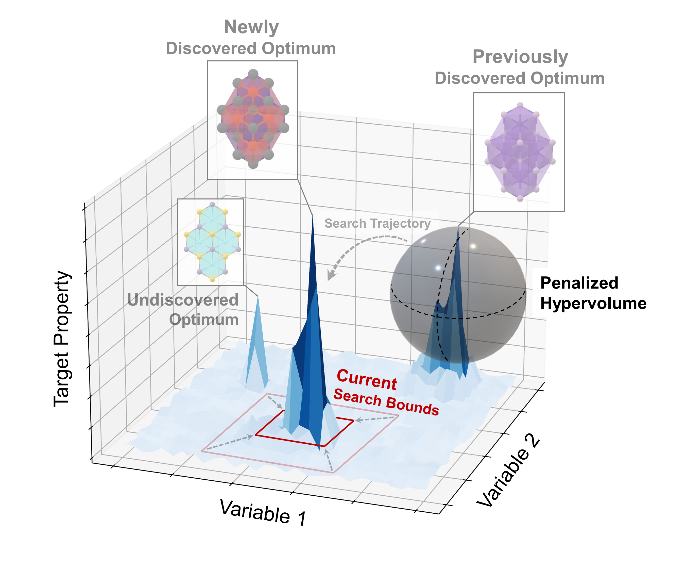

# ZoMBI-Hop

**Zero-shot Multi-modal Bayesian Inference with Hops** — multi-modal Bayesian optimization over a probability simplex, designed for high-dimensional materials composition search.



> **Version:** ellipsoid branch (Edit 1 / 2A / 2B applied May 2026)  
> **Location:** `src/`  
> **Last updated:** May 2026 — reflects current code state

---

## Table of Contents

1. [The Problem](#1-the-problem)  
2. [The Algorithm — High-Level Story](#2-the-algorithm--high-level-story)  
3. [Operational Flow Diagram](#3-operational-flow-diagram)  
4. [All Hyperparameters & What They Control](#4-all-hyperparameters--what-they-control)  
5. [File-by-File Reference](#5-file-by-file-reference)  
   - [utils/simplex.py](#51-utilssimplexpy)  
   - [utils/dataclasses.py](#52-utilsdataclassespy)  
   - [utils/datahandler.py](#53-utilsdatahandlerpy)  
   - [utils/gp_simplex.py](#54-utilsgp_simplexpy)  
   - [core/linebo.py](#55-corelinebopy)  
   - [core/zombihop.py](#56-corezombihoppy)  
   - [utils/visualization.py](#57-utilisvisualizationpy)  
6. [Key Mathematical Derivations](#6-key-mathematical-derivations)  
7. [Benefits, Drawbacks, and Known Failure Modes](#7-benefits-drawbacks-and-known-failure-modes)  
8. [Recent Algorithm Edits (May 2026)](#8-recent-algorithm-edits-may-2026)  

---

## 1. The Problem

ZoMBI-Hop solves **multi-modal Bayesian optimization over a probability simplex**.

The canonical use case is **materials composition search**: given *d* components (e.g. Pb, Sn, Br, I in a perovskite), each composition is a point on the *d*-simplex Δ^d = { x ∈ R^d | Σ x_i = 1, x_i ≥ 0 }. The objective (e.g. solar cell efficiency, bandgap) may have **multiple local optima** — "needles in a haystack" — at very different compositions. Standard BO finds one optimum and parks there. ZoMBI-Hop systematically discovers *all* significant optima.

**Why the simplex is hard:**
- It is a curved, bounded manifold — Euclidean BO ignores both constraints.  
- Components near zero cause log-ratio coordinates to diverge.  
- Multiple optima may be separated by flat low-value regions, not just local barriers.  
- Noise in robotic synthesis means the actually-deposited composition (X_actual) deviates from the requested one (X_expected).

---

## 2. The Algorithm — High-Level Story

ZoMBI-Hop operates in **activations** (outer loop) and **zooms** (inner loop).

### The Core Idea

Each activation attempts to find and declare one new local optimum ("needle"). Once declared, that region is **permanently excluded** via an ellipsoidal penalty so the next activation explores elsewhere. This continues until the user-specified number of activations is reached or the entire simplex is covered.

### Within an Activation: Zoom-In Search

1. **Start at full simplex bounds** (or updated bounds after a failure-retry, see below).
2. Fit a **Gaussian Process** in ILR-transformed space. When the bounds are not global (i.e. we are inside a zoom), **only points within the current bounds** are used for GP training: first the pared (deduplicated) points within bounds fill the `max_gp_points` budget, then raw unpenalized points within bounds fill the remainder. This makes the GP posterior tight and locally accurate so that EI drops quickly on genuine convergence.
3. Run **LineBO** to propose a candidate: sample random chords through the current bounds, score each chord by integrating the acquisition function along it (mean, not max), pick the best chord, and have the physical experiment evaluate that line.
4. After each evaluation, check **convergence**: EI (expected improvement) is computed against the **local best** (best unpenalized point within the current zoom bounds, and `best_f` from the local GP training set). If EI drops below the output-noise floor AND the Y improvement since the previous local best is within output noise, increment a consecutive-converged counter.
5. After `n_consecutive_converged` consecutive converged iterations, declare a needle.
6. Before the next zoom: **Jaccard-aware sliding-window bounds selection** (`determine_new_bounds`) slides over windows of top-M points ranked by Y, picking the first candidate AABB whose Jaccard overlap against the last `jaccard_window` entries in `bounds_history` is ≤ `jaccard_threshold`. If all windows exceed the threshold, the least-overlapping window is used.
7. **Secondary Jaccard guard (MC):** if the selected AABB still has Monte Carlo Jaccard > `zoom_jaccard_threshold` with any entry in `zoom_bounds_history`, the algorithm **force-declares a needle** at the current best unpenalized point — repeated zooms to the same region are taken as evidence the optimum is there even if PI hasn't formally converged.
8. Otherwise, zoom in on the new AABB and continue.

### Needle Declaration

On needle declaration (either via PI convergence or Jaccard force-declare):
1. Fit a **clean local GP** using `fit_with_locality`: selects only data within `max_radius` of the needle first, then fills to `max_gp_points` with remaining points. This gives a locally-accurate Hessian uncontaminated by far-away observations.
2. Compute the **Hessian of the clean base acquisition** (no repulsive penalties) at the needle in ILR space via `create_clean_acquisition`. The penalty-free acquisition gives the true local curvature rather than one distorted by proximity to other needles.
3. Derive an **ellipsoidal exclusion zone** M from the Hessian: the region where the acquisition has dropped by a specified fraction from its peak.
4. Record the needle, storing both the **peak value** and the **median Y of all raw observations within `paring_spatial_halfnoise × input_noise_ilr`** of the needle in ILR space. The median is a noise-robust measure of the local optimum's true value.
5. Update the penalty mask, reset to full simplex for the next activation.

### Post-Activation Pared Relabeling

After every activation completes (needle found or failed), each entry in the pared dataset has its Y value replaced by the **median of all Y_all values whose X_all falls within `paring_spatial_halfnoise × input_noise_ilr`** in ILR space. This smooths noise spikes so the GP in subsequent activations trains on a clean, representative signal rather than individual noisy measurements.

### Failure Handling (Three-Way Dispatch)

The zoom loop is a `while current_zoom < max_zooms` loop rather than a fixed `for zoom` loop, which allows retrying the **same zoom level** on failure without advancing. Two per-activation flags track state: `first_failure_handled` and `data_added_since_last_failure`.

When an activation fails (candidate is None, all points penalized, or force-declare returned None):

| Condition | Action |
|-----------|--------|
| **First failure** (`not first_failure_handled`) | Recompute all needle ellipsoids using the clean local GP (`recompute_all_ellipsoids`): for each needle, `fit_with_locality` → `create_clean_acquisition` → `determine_penalty_ellipsoid`. Update `dh.needle_M_list`. Retry same zoom. |
| **Subsequent failure, data was added** (`first_failure_handled AND data_added_since_last_failure`) | Recompute zoom bounds Jaccard-aware: `dh.determine_new_bounds(add_to_history=False)`. The `add_to_history=False` prevents failure-retry bounds from contaminating the history used by success-path zooms. Retry same zoom. |
| **Subsequent failure, no new data** (`first_failure_handled AND NOT data_added_since_last_failure`) | Shrink all ellipsoid semi-axes: `dh.shrink_all_needle_radii(bounds_shrink_factor)`. If `max_needle_radius() < min_axis_noise_mult × input_noise_ilr`, all exclusion zones are at noise scale → stop. Otherwise retry same zoom. |

`data_added_since_last_failure` is set `True` immediately after `_objective_wrapper` returns (regardless of whether points are penalized), and reset to `False` after each failure dispatch.

### Point Paring (Deduplication)

Before any point enters the GP training set, it is checked against the **pared dataset** — a noise-deduplicated subset. Two points are considered duplicates if their ILR-space distance is less than `paring_spatial_halfnoise × σ_ILR` AND their Y-values differ by less than `paring_y_noise_multiplier × σ_Y`. Duplicates are handled by a fair coin: keep the old or replace with the new. This prevents noise spikes from dominating the GP. After each activation, all pared Y values are further smoothed via local medians (see above).

---

## 3. Operational Flow Diagram

```
╔══════════════════════════════════════════════════════════════════════════╗
║                         ZoMBI-Hop: run()                                ║
╠══════════════════════════════════════════════════════════════════════════╣
║                                                                          ║
║  INIT: load X_init, Y_init → build pared set → set bounds = full Δ     ║
║                                                                          ║
║  ┌─────────────────────────────────────────────────────────────────┐    ║
║  │  OUTER LOOP: activation = 0 … max_activations                  │    ║
║  │                                                                  │    ║
║  │  first_failure_handled = False                                   │    ║
║  │  data_added_since_last_failure = False                           │    ║
║  │  zoom_bounds_history = []                                        │    ║
║  │                                                                  │    ║
║  │  ┌──────── ZOOM LOOP: while current_zoom < max_zooms ──────────┐ │   ║
║  │  │  zoom = current_zoom                                        │ │   ║
║  │  │                                                             │ │   ║
║  │  │  [1] if global bounds: get_gp_data()                       │ │   ║
║  │  │      else: get_zoom_gp_data(bounds)                        │ │   ║
║  │  │      → pared in bounds first, then raw fill                │ │   ║
║  │  │  [2] GPSimplex.fit(X_ilr / ilr_std, Y)                     │ │   ║
║  │  │      best_f_local = Y.max()                                │ │   ║
║  │  │                                                             │ │   ║
║  │  │  ┌──── ITERATION LOOP: iter = 0 … max_iterations ────────┐ │ │   ║
║  │  │  │                                                        │ │ │   ║
║  │  │  │  [3] get_candidate(bounds, best_f=best_f_local)       │ │ │   ║
║  │  │  │      • RepulsiveAcquisition(UCB/EI) on seeds          │ │ │   ║
║  │  │  │      • nat-grad ascent on top-n_restarts seeds        │ │ │   ║
║  │  │  │      → candidate (d,) on simplex                      │ │ │   ║
║  │  │  │                                                        │ │ │   ║
║  │  │  │  if candidate is None → activation_failed, break      │ │ │   ║
║  │  │  │                                                        │ │ │   ║
║  │  │  │  prev_best ← get_best_in_bounds(bounds)               │ │ │   ║
║  │  │  │    (or get_best_unpenalized if global bounds)          │ │ │   ║
║  │  │  │                                                        │ │ │   ║
║  │  │  │  [4] LineBO.sampler(candidate, bounds, acq_fn)        │ │ │   ║
║  │  │  │      • generate num_lines random chords               │ │ │   ║
║  │  │  │      • score by mean acq over 100 pts                 │ │ │   ║
║  │  │  │      → (X_expected, X_actual, Y)                      │ │ │   ║
║  │  │  │  data_added_since_last_failure = True  ← always       │ │ │   ║
║  │  │  │                                                        │ │ │   ║
║  │  │  │  [5] add_all_points() → update pared set,             │ │ │   ║
║  │  │  │       penalty mask, and snapshot                       │ │ │   ║
║  │  │  │                                                        │ │ │   ║
║  │  │  │  [6] refit GP (local data if zoomed)                  │ │ │   ║
║  │  │  │      best_f_local = Y.max()                           │ │ │   ║
║  │  │  │                                                        │ │ │   ║
║  │  │  │  [7] check_convergence(best_f_ref=best_f_local)       │ │ │   ║
║  │  │  │      PI vs local best; ΔY vs prev_best in bounds      │ │ │   ║
║  │  │  │      consecutive_converged++                           │ │ │   ║
║  │  │  │                                                        │ │ │   ║
║  │  │  │  if consecutive_converged >= n_consecutive:            │ │ │   ║
║  │  │  │    [8] _declare_needle_at_best()                      │ │ │   ║
║  │  │  │        • fit_with_locality(needle) → local clean GP   │ │ │   ║
║  │  │  │        • create_clean_acquisition() (no repulsion)    │ │ │   ║
║  │  │  │        • determine_penalty_ellipsoid → M              │ │ │   ║
║  │  │  │        • compute local median Y within σ_ILR          │ │ │   ║
║  │  │  │        • add_needle(value, median_value, M)           │ │ │   ║
║  │  │  │        • reset bounds to full Δ                       │ │ │   ║
║  │  │  │        → break zoom loop (needle found)               │ │ │   ║
║  │  │  └────────────────────────────────────────────────────── ┘ │ │   ║
║  │  │                                                             │ │   ║
║  │  │  ── AFTER ITERATION LOOP ──────────────────────────────    │ │   ║
║  │  │                                                             │ │   ║
║  │  │  if activation_failed:                                      │ │   ║
║  │  │    → _handle_failure_retry() three-way dispatch:           │ │   ║
║  │  │      Case 1 (first failure):                               │ │   ║
║  │  │        recompute_all_ellipsoids (clean local GP each)      │ │   ║
║  │  │        update needle_M_list  → retry same zoom             │ │   ║
║  │  │      Case 2 (subsequent, data added):                      │ │   ║
║  │  │        determine_new_bounds(add_to_history=False)          │ │   ║
║  │  │        update bounds  → retry same zoom                    │ │   ║
║  │  │      Case 3 (subsequent, no data):                         │ │   ║
║  │  │        shrink_all_needle_radii(bounds_shrink_factor)       │ │   ║
║  │  │        if max_radius < min_axis_noise_mult×σ → finished   │ │   ║
║  │  │        else → retry same zoom                              │ │   ║
║  │  │    data_added_since_last_failure = False                   │ │   ║
║  │  │    consecutive_converged = 0                               │ │   ║
║  │  │    continue  ← same current_zoom, retry zoom body         │ │   ║
║  │  │                                                             │ │   ║
║  │  │  if no needle AND no failure AND zoom < max_zooms-1:        │ │   ║
║  │  │    [9a] determine_new_bounds() ← Jaccard sliding window    │ │   ║
║  │  │         slides over Y-sorted unpenalized; picks AABB with  │ │   ║
║  │  │         Jaccard ≤ jaccard_threshold vs bounds_history      │ │   ║
║  │  │    [9b] MC Jaccard guard vs zoom_bounds_history:           │ │   ║
║  │  │         if Jaccard > zoom_jaccard_threshold:               │ │   ║
║  │  │           → _declare_needle_at_best() ← force-declare      │ │   ║
║  │  │           (if no unpenalized pts → activation_failed)      │ │   ║
║  │  │         else: append to zoom_bounds_history; zoom in       │ │   ║
║  │  │    current_zoom += 1  ← advance only on clean success      │ │   ║
║  │  │                                                             │ │   ║
║  │  └─────────────────────────────────────────────────────────── ┘ │   ║
║  │                                                                  │   ║
║  │  _relabel_pared_with_medians()  ← smooth pared Y after activation│   ║
║  │  activation++ → next activation                                  │   ║
║  └─────────────────────────────────────────────────────────────────┘   ║
║                                                                          ║
║  return (needle_results, needle_locations, needle_vals, X_all, Y_all)  ║
╚══════════════════════════════════════════════════════════════════════════╝
```

Data flow between key objects:

```
ZoMBIHop
  │
  ├─ DataHandler ── owns ALL persistent state
  │     ├── X_all_actual, Y_all                (raw observations)
  │     ├── X_pared, Y_pared                   (deduped GP training set,
  │     │                                        relabeled with medians
  │     │                                        after each activation)
  │     ├── needles, needle_M_list, needle_B    (discovered optima + ellipsoids)
  │     ├── needles_results                     (value + median_value per needle)
  │     ├── _penalty_mask                       (True = not penalized)
  │     ├── bounds, current_zoom_bounds         (trust region)
  │     └── bounds_history                      (recent AABB tensors for Jaccard)
  │
  ├─ GPSimplex ── wraps BoTorch GP
  │     ├── fit(X, Y)              ILR + std-normalize → SingleTaskGP
  │     ├── fit_with_locality()    local-only GP around a needle
  │     ├── create_acquisition()   RepulsiveAcquisition (with needle penalties)
  │     ├── create_clean_acquisition()  penalty-free acquisition for Hessian
  │     ├── recompute_all_ellipsoids()  bulk ellipsoid refit (one local GP per needle)
  │     ├── get_candidate()        raw_samples → nat-grad ascent → best point
  │     └── determine_penalty_ellipsoid(acq_fn=...)  Hessian M in ILR space
  │
  └─ LineBO ── evaluates the physical objective
        ├── ranked_line_endpoints()  → score chords by mean acquisition
        └── sampler()               → call objective_function with ranked endpoints
```

---

## 4. All Hyperparameters & What They Control

### Iteration Structure

| Parameter | Default | Controls |
|-----------|---------|----------|
| `max_zooms` | 3 | Number of zoom levels per activation. More zooms = finer trust regions but more iterations before declaring a needle. Also used as the Jaccard history window size. |
| `max_iterations` | 10 | Max BO iterations per zoom level. Total per activation ≤ max_zooms × max_iterations. |
| `n_consecutive_converged` | 2 | How many successive converged iterations trigger needle declaration. Higher = more conservative (requires sustained convergence). |
| `top_m_points` | auto (d+1) | How many top-Y unpenalized points define the AABB zoom bounds. Small = tight zoom; large = wide. |

### Convergence Thresholds

| Parameter | Default | Controls |
|-----------|---------|----------|
| `convergence_pi_threshold` | 0.01 | **Deprecated / ignored.** Convergence now uses Expected Improvement vs the output-noise floor (`EI < GP_output_noise × output_noise_threshold_mult`); there is no separate PI threshold. Kept only so older configs/JSONs still load. |
| `input_noise_threshold_mult` | 3.0 | Minimum trust-region width is this multiple of `input_noise` (`DataHandler.min_box_width`); each axis of a candidate zoom box narrower than that is widened about its centre before the Jaccard novelty test. 0 disables the floor. |
| `output_noise_threshold_mult` | 2.0 | Y improvement (over the **local** prev_best within bounds) must be < this × GP output noise. Higher = easier to converge. |

### GP & Acquisition

| Parameter | Default | Controls |
|-----------|---------|----------|
| `max_gp_points` | 3000 | Cap on GP training set size. When zoomed, this budget is filled first by pared points within bounds, then by raw unpenalized points within bounds. Prevents O(n³) GP cost blowing up. |
| `acquisition_type` | "ucb" | Base acquisition: `"ucb"` (Upper Confidence Bound) or `"ei"` (Log Expected Improvement). |
| `ucb_beta` | 0.1 | Exploration weight for UCB: α(x) = μ + β½σ. Higher = more exploration. |
| `repulsion_lambda` | None (auto) | Strength of ellipsoid repulsion penalty. `None` = auto-computed as max(10×median\|acq\|, 100) each call. |
| `n_restarts` | 30 | Number of nat-grad restarts for acquisition optimization (get_candidate). |
| `raw` | 500 | Initial random samples before selecting restart seeds. |
| `nat_grad_step` | 0.02 | Step size α for natural-gradient ascent: x ← normalize(x ⊙ exp(α(g − ḡ))). |
| `nat_grad_max_steps` | 50 | Max gradient steps per restart. |

### Ellipsoid Penalty

| Parameter | Default | Controls |
|-----------|---------|----------|
| `max_penalty_radius` | 1.0 | Caps the maximum ellipsoid semi-axis length (ILR units). Prevents a single needle from excluding too much of the simplex. |
| `ellipsoid_drop_fraction` | 0.25 | Fraction of peak acquisition value that defines the ellipsoid boundary. Larger = bigger exclusion zone. |
| `ellipsoid_eigenvalue_floor` | 1e-6 | Minimum eigenvalue of –H before computing M. Prevents degenerate flat-Hessian ellipsoids. |

### Point Paring (Deduplication)

| Parameter | Default | Controls |
|-----------|---------|----------|
| `paring_spatial_halfnoise` | 0.5 | Spatial duplicate threshold in ILR units: points within `factor × input_noise_ilr` are candidates for deduplication. Also controls the neighbourhood radius for median relabeling of pared Y values and the needle median value computation. |
| `paring_y_noise_multiplier` | 1.0 | Y-value duplicate threshold: `factor × GP_output_noise`. |
| `input_noise` | 0.064 | Known physical input noise σ per composition component (instrument precision), measured from `data/2nd_real_run.db`. Used for paring, median neighbourhood radius, needle shrink stop condition, old-needle radius, and the GP min-lengthscale floor. (Legacy `input_noise_ilr` ≈ `input_noise × 3` is still accepted and converted.) |

### Needle Shrink & Stop

| Parameter | Default | Controls |
|-----------|---------|----------|
| `needle_shrink_factor` | 0.85 | Per-demotion-retry multiplicative shrink on all ellipsoid radii. M ← M / f² tightens the exclusion zone. |
| `needle_stop_noise_multiplier` | 3.0 | Stop shrinking when max ellipsoid semi-axis < this × `input_noise_ilr`. Prevents shrinking below measurement resolution. |

### Repeated-Zoom Detection (Jaccard Sliding Window)

| Parameter | Default | Controls |
|-----------|---------|----------|
| `jaccard_window` | 3 | Number of recent bounding boxes to compare against when selecting new zoom bounds. `determine_new_bounds` slides over windows of top-M points to find a box with Jaccard ≤ `jaccard_threshold` vs all recent boxes in this window. |
| `jaccard_threshold` | 0.9 | Maximum Jaccard overlap allowed between a candidate bounding box and any box in the recent history window. A higher value accepts more overlap before trying the next window. |

The secondary MC Jaccard guard (`_bounds_jaccard_simplex`, threshold 0.75) is still used at zoom transitions as a force-declare trigger when the sliding-window bounds selection nonetheless produces a box that overlaps with history.

### Failure Retry

| Parameter | Default | Controls |
|-----------|---------|----------|
| `bounds_shrink_factor` | 0.8 | Radius shrink factor applied to all needle ellipsoids on a persistent-failure (no new data) retry. M ← M / factor². |
| `min_axis_noise_mult` | 2.0 | Stop condition for shrinking: if `max_needle_radius() < min_axis_noise_mult × input_noise_ilr`, all ellipsoids are at noise scale and the run terminates. |

---

## 5. File-by-File Reference

### 5.1 `utils/simplex.py`

**Role:** Low-level geometry on the probability simplex. All other modules import from here.

#### `Ellipsoid` (namedtuple)

Named triple `(c, M, B)`:
- `c`: (d,) centre on Δ  
- `M`: (d−1, d−1) SPD precision matrix — a point x is inside when u⊤M u ≤ 1, u = B⊤(x−c)  
- `B`: (d, d−1) orthonormal tangent-space columns (zero-sum hyperplane basis)

#### `composition_to_ilr(x)` ← critical transform

**Forward ILR (Helmert contrasts):**

For i = 0, …, d−2:

$$z_i = \sqrt{\frac{i+1}{i+2}} \left( \frac{1}{i+1}\sum_{j=0}^{i} \log x_j - \log x_{i+1} \right)$$

Maps compositions (d,) → ILR coordinates (d−1,). ILR is an isometry: Euclidean distances in ILR space equal Aitchison distances in simplex space.

**Why it matters:** The GP is trained in ILR space, where the simplex constraint is lifted to all of R^{d−1} and the geometry is Euclidean. Kernel lengthscales have consistent meaning across the simplex (unlike raw compositions, where corners are geometrically compressed).

#### `random_simplex(num_samples, a, b, S, ...)` ← CFS sampler

Samples uniformly from the bounded probability simplex using **Conditional Frechet Sampling** (inclusion-exclusion polytope volume + Newton CDF inversion). Complexity O(2^d); maximum d = 20.

#### `proj_simplex(X)`

Projects arbitrary R^d points onto the probability simplex (Duchi et al., 2008). Differentiable — safe to use inside autograd.

---

### 5.2 `utils/dataclasses.py`

**Role:** Configuration dataclasses. `ZoMBIHopConfig` is the single source of truth for all hyperparameters; `Checkpoint` is a legacy metadata struct for backward compatibility.

#### `ZoMBIHopConfig` (dataclass)

All hyperparameters with defaults (see §4). Key methods: `to_dict()` / `from_dict(data)` (JSON serialization, unknown keys silently dropped), `get_torch_dtype()`, `__post_init__()` (validates all fields on construction).

---

### 5.3 `utils/datahandler.py`

**Role:** The single owner of all mutable algorithm state. Every tensor, counter, and needle record lives here. `ZoMBIHop` and `GPSimplex` both hold a reference and call these methods.

Key methods:

| Method | Description |
|--------|-------------|
| `save_init(...)` | Populates tensors from initial data, builds pared set, writes `config.json`, takes permanent "init" snapshot. |
| `take_snapshot(...)` | Saves complete state to `run_dir/snapshots/{seq}_{label}/`: `tensors.pt`, `needles.json`, `summary.json`. |
| `add_all_points(...)` | Appends new observations, updates pared set and penalty mask. |
| `add_needle(...)` | Records needle with peak value, median value, ellipsoid M. |
| `get_gp_data()` | Returns global GP training set (pared → raw unpenalized → init fallback). |
| `get_zoom_gp_data(bounds)` | Local variant restricted to bounds (pared within bounds first, then raw fill). |
| `get_best_in_bounds(bounds)` | Best unpenalized point within axis-aligned bounds. |
| `determine_new_bounds(...)` | Jaccard sliding-window AABB selection. |
| `_relabel_pared_with_medians()` | Post-activation smoothing: replaces each pared Y with local median. |
| `shrink_all_needle_radii(factor)` | Multiplies each needle M by 1/factor² (failure-retry Case 3). |
| `update_all_needle_radii(new_M_list)` | Replaces needle M matrices (failure-retry Case 1). |
| `max_needle_radius()` | Largest semi-axis across all needle ellipsoids. |

---

### 5.4 `utils/gp_simplex.py`

**Role:** Wraps a BoTorch `SingleTaskGP` with ILR normalization and provides acquisition creation, candidate generation, and Hessian ellipsoid computation.

#### `ILRWrappedAcquisition`

Takes simplex inputs, transforms to ILR, optionally divides by `ilr_std`, then calls the underlying BoTorch acquisition. Necessary because BoTorch acquisitions expect unconstrained R^{d−1} inputs.

#### `RepulsiveAcquisition`

Combines base acquisition with smooth needle repulsion:

$$\alpha_{\text{rep}}(x) = \alpha_{\text{base}}(x) - \lambda \sum_{i} \max\!\left(0,\; 1 - \delta z_i^\top M_i \delta z_i\right)^2$$

Zero outside the ellipsoid, rising quadratically toward the centre (soft boundary). λ auto-computed as max(10 × median|α|, 100) when not specified.

#### `GPSimplex.fit(X, Y)`

1. X → ILR; compute per-dimension std; std-normalize.  
2. Fit BoTorch `SingleTaskGP` + `fit_gpytorch_mll`.  
3. Update DataHandler's stored output noise.

**Why std-normalize ILR:** ILR dimensions may have very different dynamic ranges, causing poorly-calibrated kernel lengthscales. Normalizing by observed std puts all dimensions on equal footing.

#### `GPSimplex.get_candidate(bounds, best_f, ...)` → Tensor or None

1. `create_acquisition(best_f)` → RepulsiveAcquisition  
2. Sample `raw_samples` random points, score by acquisition  
3. Filter by penalty mask; sort; take top `n_restarts`  
4. Run natural-gradient ascent on seeds  
5. Final penalty check on winner → return or None

**Natural-gradient ascent:** x ← normalize(x ⊙ exp(α(g − ḡ))), the exponential map on the probability simplex respecting the Fisher information metric.

#### `GPSimplex.determine_penalty_ellipsoid(needle, ...)` → (M, None)

Computes Hessian of acquisition at needle in ILR space via `torch.autograd.functional.hessian`. Derives M = neg_H / (2Δ) where Δ is the acquisition drop criterion. Semi-axes = 1/√(eigenvalues of M). Always called with `create_clean_acquisition()` (no repulsion) during needle declaration.

---

### 5.5 `core/linebo.py`

**Role:** Physical experiment interface. Proposes a line to evaluate, calls the user-supplied objective, returns observations.

#### `LineBO._integrate_acquisition_along_lines(...)`

Scores each chord by **mean** acquisition over N uniformly-spaced points (not max). Mean integrates penalties along the full chord — a line spending most of its length inside a penalized region scores very negatively.

#### `LineBO.sampler(x_tell, bounds, acquisition_function)` → (x_requested, x_actual, y)

1. `ranked_line_endpoints` → sorted (x_left, x_right)  
2. Call `objective_function(endpoints_ranked)`  
3. Build `x_requested` from first principal direction of `x_actual` via SVD

---

### 5.6 `core/zombihop.py`

**Role:** Top-level orchestrator. Owns the activation/zoom/iteration loops, needle declaration, failure handling, convergence checking, and Jaccard-based repeated-zoom detection.

#### `ZoMBIHop._check_convergence_to_needle(...)` → (converged, ei, log_ei)

Convergence requires **both**:
1. EI(candidate) < GP_output_noise × `output_noise_threshold_mult` (the GP expects no more than noise-level improvement)
2. (current batch best Y) − (prev_best_Y) < GP_output_noise × `output_noise_threshold_mult`

`best_f_ref` is `Y.max()` from `get_zoom_gp_data(bounds)` — EI is measured against the best observation *within current bounds*, not globally.

#### `ZoMBIHop._declare_needle_at_best(...)` → Optional[Tensor]

1. Get current best unpenalized point  
2. Compute needle median value (median Y within `paring_spatial_halfnoise × input_noise_ilr`)  
3. `fit_with_locality` → clean local GP  
4. `create_clean_acquisition` → penalty-free acquisition  
5. `determine_penalty_ellipsoid` → M  
6. `dh.add_needle(..., needle_median_value=median)`  
7. Reset bounds to full simplex

Called on PI convergence (`reason="PI convergence"`) or Jaccard force-declare (`reason="Jaccard convergence"`).

---

### 5.7 `utils/visualization.py`

**Role:** Plotting utilities for ternary (d=3) and tetrahedral (d=4) problems plus progress tracking.

- `plot_optimization_progress` — three-panel: best Y, needle count, total points over iterations  
- `plot_simplex_2d` — ternary diagram with colormap scatter + needle stars  
- `plot_simplex_3d` — tetrahedral 3D plot projecting 4-simplex coordinates to 3D  
- `plot_needles_summary` — bar chart of needle values + discovery timeline

---

## 6. Key Mathematical Derivations

### 6.1 ILR as an Isometry

The ILR transform is an isometry from (Δ^d, d_A) to (R^{d−1}, ‖·‖₂) where d_A is the Aitchison distance:

$$d_A(x, y) = \|ILR(x) - ILR(y)\|_2$$

The SE kernel in ILR space is therefore an Aitchison-stationary kernel on the simplex — exactly the right prior for composition-valued data.

### 6.2 Natural Gradient on the Simplex

The Fisher information metric on the probability simplex at point x is g_{ij}(x) = δ_{ij}/x_i. The exponential map gives the multiplicative update:

$$x \leftarrow \frac{x \odot \exp(\alpha(g - \bar{g}))}{\sum_i x_i \exp(\alpha(g_i - \bar{g}))}$$

where $\bar{g} = \sum_i x_i g_i$ is the weighted mean gradient.

### 6.3 Hessian Ellipsoid Geometry

At the needle z* = ILR(x*), Taylor expansion of the acquisition gives:

$$\alpha(z) \approx \alpha(z^*) + \frac{1}{2}(z-z^*)^\top H (z-z^*)$$

Since z* is a maximum, H is negative semi-definite. Define neg_H = −H. The iso-acquisition surface where α drops by Δ from the peak is:

$$\delta z^\top M \delta z = 1, \quad M = \text{neg\_H} / (2\Delta)$$

Semi-axes: $r_i = 1/\sqrt{\lambda_i(M)}$ in ILR units.

### 6.4 Local vs Global GP and PI Scope

When zoomed into bounds B ⊂ Δ, PI is:

$$\text{PI}(x) = \Phi\!\left(\frac{\mu(x) - f^*}{\sigma(x)}\right)$$

where f* = `best_f_local` = max Y from `get_zoom_gp_data(B)`. Two locality effects: σ(x) is smaller within B (tighter posterior from local data), and f* is the local best (PI not trivially near-zero when a higher value exists in another region).

---

## 7. Benefits, Drawbacks, and Known Failure Modes

### Benefits

| Aspect | Benefit |
|--------|---------|
| **Multi-modal discovery** | Guaranteed-different optima via hard ellipsoidal exclusion zones — each activation finds a new basin. |
| **Simplex fidelity** | ILR + CFS + natural gradient ascent all respect the simplex geometry exactly. |
| **Noise-robustness** | Point paring prevents noise spikes from poisoning the GP. Pared Y values are relabeled with local medians after each activation. Needle records store both peak and median values. |
| **Adaptive exclusion zones** | Hessian ellipsoids adapt to local curvature — narrow along flat directions, tight along steep ones. |
| **Failure recovery** | Three-way in-place failure dispatch (clean ellipsoid refit → Jaccard-aware bounds update → radius shrink) handles both transient and persistent failures without restarting the zoom sequence. |
| **Reproducibility** | Full state snapshots at every iteration enable exact restart. |
| **Local GP for zoom** | Fitting only within-bounds data makes the posterior tight in the active region, causing PI to drop quickly on genuine convergence. |
| **Clean local GP for ellipsoids** | Needle ellipsoids are computed from a local, penalty-free GP fit, giving curvature estimates that reflect only the local landscape. |
| **Jaccard sliding window** | `determine_new_bounds` slides over Y-ranked windows to find a genuinely different AABB before the MC Jaccard guard runs. |

### Drawbacks

| Aspect | Drawback |
|--------|---------|
| **GP cost** | O(n³) GP fitting. Mitigated by `max_gp_points` truncation and local data restriction. |
| **CFS dimension limit** | `random_simplex` requires d ≤ 20 (2^d inclusion-exclusion). |
| **Hessian accuracy** | Hessian computed at one point; flat/curved acquisition tops may produce poorly-sized ellipsoids. |
| **AABB zoom bounds** | Axis-aligned bounding box ignores simplex geometry — can straddle inactive corners. |
| **Natural gradient pathology** | Multiplicative update can get stuck at simplex vertices (x_i = 0 freezes that coordinate). |
| **Jaccard is approximate** | Monte Carlo Jaccard (n=500) has sampling noise; the 0.75 threshold is a heuristic. |

### Known Failure Modes

**Over-clustering at one corner:** Fixed by `mean` line scoring (integrates penalties along the full chord rather than taking max).

**Pared set contamination:** `_update_penalty_mask()` purges the pared set after every needle addition/refit.

**Zoom loop stagnation:** Fixed by (1) `determine_new_bounds` sliding window to find dissimilar AABB, (2) MC Jaccard guard force-declares needle rather than triggering failure, (3) Edit 2B failure retry at same zoom level.

**Spurious PI convergence:** Fixed by local GP + local `best_f_ref` + local `prev_best`. PI is computed against the best observation *within current zoom bounds*.

---

## 8. Recent Algorithm Edits (May 2026)

### Edit 1 — Clean Local GP for Needle Ellipsoid Fitting

**Problem:** Needle ellipsoid Hessian was computed from a GP trained on local (zoom-restricted) data but through `RepulsiveAcquisition`, which distorts curvature near other needles.

**Fix:** `fit_with_locality` + `create_clean_acquisition` (no repulsion penalties) are now used during needle declaration, so M reflects only true local curvature. `recompute_all_ellipsoids` applies this to all needles on failure-retry Case 1.

---

### Edit 2A — Jaccard Sliding-Window Bounds Selection

**Problem:** `determine_new_bounds` always returned the AABB of the top-M points by Y, producing nearly-identical boxes on successive zooms and triggering immediate force-declare.

**Fix:** Sliding-window search over Y-ranked unpenalized points finds the first AABB with Jaccard ≤ `jaccard_threshold` vs recent `bounds_history`. Falls back to the least-similar window if none qualifies.

New parameters: `jaccard_window` (default 3), `jaccard_threshold` (default 0.9).

`_jaccard_box(a, b)`: volume-Jaccard of two axis-aligned boxes; zero-width dimensions in both boxes are projected out to avoid division by zero.

---

### Edit 2B — Failure Retry Within Activation

**Problem:** The old outer `while True` demotion-retry loop rewound to zoom 0 on failure, restarting the full zoom sequence — expensive and prone to infinite loops.

**Fix:** Zoom loop restructured to `while current_zoom < max_zooms`. On failure, `_handle_failure_retry` dispatches in-place and issues `continue` to retry the **same zoom level**.

```
Case 1 (first failure):
    recompute_all_ellipsoids → update_all_needle_radii → retry same zoom

Case 2 (repeated failure, new data since last failure):
    determine_new_bounds(add_to_history=False) → retry same zoom

Case 3 (repeated failure, no new data):
    shrink_all_needle_radii(bounds_shrink_factor)
    if max_radius < min_axis_noise_mult × σ_ILR → stop
    else → retry same zoom
```

`current_zoom` is incremented **only on clean success** (no failure, no force-declare).

New parameters: `bounds_shrink_factor` (default 0.8), `min_axis_noise_mult` (default 2.0).
